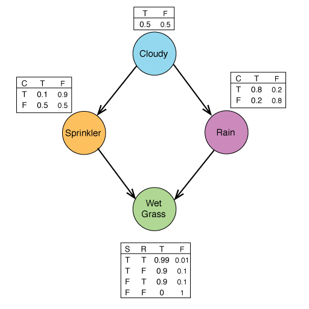

Python Bayesian Network Toolbox (PBNT)<br/> Bayes Network Model for Python 2.7
=========================

PBNT is a bayesian network model for python that was created by Elliot Cohen in 2005. This version updates his version that was built for Python 2.4 and adds support for modern python libraries. Most namely, it removes the reference to numArray and replaces it with numPy.

With this library it is possible to input a Bayesian Network with probabilities/conditional probabilities on each node to calculate the marginal and conditional probabilities of queries on the network.

The original version of the project [can be found here](http://sourceforge.net/projects/pbnt.berlios/)

PBNT Usage
-------------------
You must first have the [NumPy](http://www.numpy.org/) package installed.

###The included example network:
The example files give a simple example of how a Bayes Network can be implemented. It uses a Bayes Network created from 4 nodes, Cloudy, Rainy, Sprinkler, and WetGrass.

Here is a layout of what the network looks like
Inline-style:



To run the example files navigate to the examples directory and run:
```
python exampleinference.py
```
if everything is working properly, you should get:
```
The marginal probability of sprinkler=false: 0.7
The marginal probability of wetgrass=false | cloudy=False, rain=True: 0.3025
```

Creating a Model:
-------------------

**BayesNode(id,numValues,name)**

  - id: Integer Identification of the node
  - numValues: Number of associated values with the node
  - name: name for the node in form ```name="name_of_node"```

Example:
```python
cNode = BayesNode(0, 2, name="cloudy")
```

To Be Completed...


Project information
-------------------
**Modified from:**<br/>
Python Bayes Network Toolbox.
Copyright (c) 2005, Elliot Cohen. All rights reserved.

**Updated to work with Python 2.7** by Brandon Mikulka
